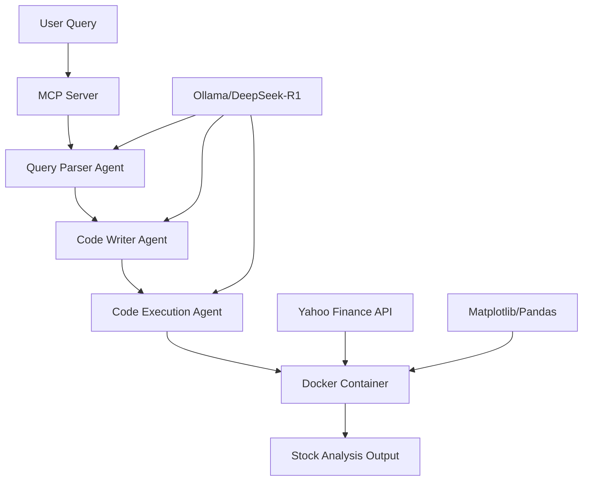

# MCP-Powered Financial Analyst

[](https://python.org)
[](https://github.com/joaomdmoura/crewAI)
[](https://ollama.ai)
[](https://github.com/modelcontextprotocol)
[](https://docker.com)

A sophisticated **multi-agent AI system** that analyzes financial market data using local LLMs and modern AI orchestration frameworks. Built with CrewAI, DeepSeek-R1, and Model Context Protocol (MCP) for seamless integration with modern development environments.

## Features

### Core Capabilities
- **Multi-Agent Architecture**: Three specialized AI agents working in sequence
- **100% Local Processing**: DeepSeek-R1 LLM via Ollama for data privacy
- **Real-Time Financial Analysis**: Live stock data via Yahoo Finance API
- **MCP Integration**: Seamless IDE integration via Model Context Protocol
- **Containerized Execution**: Docker-based secure code execution environment
- **Advanced Visualizations**: Interactive charts and technical analysis

### AI Agent Workflow
1. **Query Parser Agent**: Extracts stock symbols, timeframes, and analysis requirements
2. **Code Writer Agent**: Generates production-ready Python analysis scripts
3. **Code Execution Agent**: Executes code safely and handles error correction

## Tech Stack

| Component | Technology | Purpose |
|-----------|------------|---------|
| **AI Orchestration** | CrewAI | Multi-agent workflow management |
| **Local LLM** | DeepSeek-R1 via Ollama | Natural language processing |
| **Data Source** | Yahoo Finance API | Real-time stock market data |
| **Visualization** | Matplotlib, Pandas | Chart generation and data analysis |
| **Integration** | Model Context Protocol (MCP) | IDE connectivity |
| **Containerization** | Docker | Secure code execution |
| **API Framework** | FastMCP | MCP server implementation |

## Prerequisites

- **Python 3.12+**
- **Docker Desktop**
- **Ollama** for local LLM serving
- **Git** for version control

## Quick Start

### 1. Clone & Setup
```bash
git clone https://github.com/Rayaan-Damani/mcp-financial-analyst.git
cd mcp-financial-analyst

# Create virtual environment
python -m venv .venv
.venv\Scripts\activate  # Windows
# source .venv/bin/activate  # macOS/Linux

# Install dependencies
pip install -r requirements.txt
```

### 2. Install & Configure Ollama
```bash
# Install Ollama (https://ollama.ai)
# Then pull the DeepSeek-R1 model
ollama pull deepseek-r1:7b
ollama serve
```

### 3. Start Docker Desktop
Ensure Docker Desktop is running for secure code execution.

### 4. Test the System
```bash
# Run standalone analysis
python finance_crew.py

# Start MCP server
python server.py
```

## Usage Examples

### Standalone Analysis
```python
from finance_crew import run_financial_analysis

# Analyze Tesla's year-to-date performance
result = run_financial_analysis("Plot YTD stock gain of Tesla")

# Compare multiple stocks
result = run_financial_analysis("Compare AAPL vs MSFT performance over 6 months")

# Technical analysis
result = run_financial_analysis("Show NVDA with moving averages and volume")
```

### MCP Integration (Cursor IDE)
1. **Configure MCP Server** in Cursor Settings:
```json
{
    "mcpServers": {
        "financial-analyst": {
            "command": "python",
            "args": ["path/to/server.py"]
        }
    }
}
```

2. **Chat with AI** in Cursor:
- "Analyze Tesla's stock performance over the last 3 months"
- "Compare Apple and Microsoft returns this year"
- "Generate a technical analysis report for NVIDIA"

## Architecture



## Sample Output

```
╭──────────────────────────────── Agent Started ─────────────────────────────────╮
│  Agent: Stock Data Analyst                                                        │
│  Task: Analyze the user query and extract stock details.                          │
╰───────────────────────────────────────────────────────────────────────────────────╯

Final Answer: {"symbols": ["TSLA"], "timeframe": "YTD", "action": "Plot YTD stock gain"}

╭──────────────────────────────── Agent Started ─────────────────────────────────╮
│  Agent: Senior Python Developer                                                   │
│  Task: Write Python code to visualize stock data                                  │
╰───────────────────────────────────────────────────────────────────────────────────╯

Generated: Production-ready Python visualization code with error handling
```

## Configuration

### Environment Variables
```bash
# Optional: Use OpenAI instead of local LLM
OPENAI_API_KEY=your_openai_key_here

# Docker settings
DOCKER_HOST=unix:///var/run/docker.sock
```

### Model Configuration
Edit `finance_crew.py` to customize the LLM:
```python
llm = LLM(
    model="ollama/deepseek-r1:7b",  # Local model
    base_url="http://localhost:11434"
)

# Alternative: OpenAI
# llm = LLM(model="openai/gpt-4o")
```

## Advanced Features

- **Technical Indicators**: RSI, MACD, Bollinger Bands
- **Portfolio Analysis**: Multi-stock comparison and correlation
- **Custom Timeframes**: Support for various date ranges
- **Error Recovery**: Automatic code debugging and fixes
- **Responsive Charts**: Interactive matplotlib visualizations


---

Star this repo if you found it helpful!
